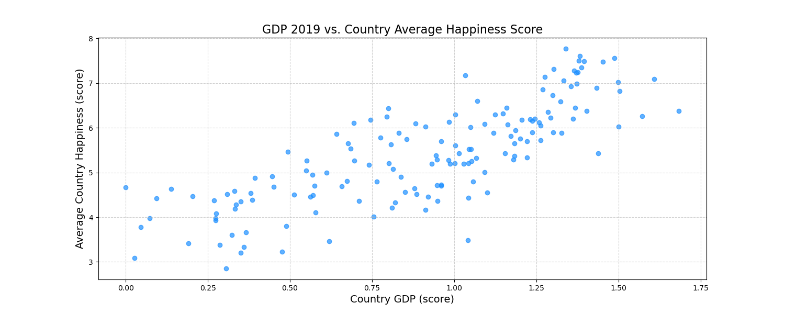
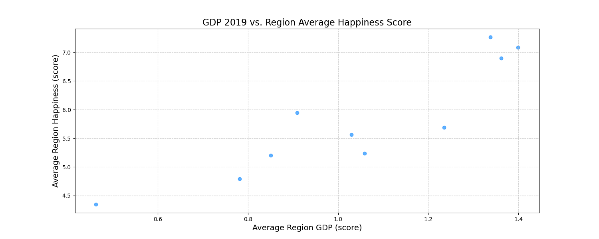

# Aless' solution 🫡

## Requirements

In order to run the script, you need the following packages:

- pandas
- matplotlib
- argparse

if you use pip, you can install the required packages using the following command:

```bash
pip install pandas matplotlib 
```

> note that `argparse` is included in the standard library of Python 3, so you don't need to install it separately.

## Description

This script will, in this order:

- Read the CSV File located in the `data` folder
- Calculate the average happiness levels by region and print the result to the console
- Print the top 10 & bottom 10 countries using the GPD Score to the console.
- Compute and print the correlation between GDP Score and happiness value
- Generate scatter charts comparing GDP vs Average Happiness by country & region
- Show or save the charts if the `save` argument is passed or not

## Usage

Launch the script using python

```bash
python3 main.py
```

if you pass the argument `--save` the script won't launch a window displaying the charts but will instead save images of the charts in the same folder of the script: `/python`

```bash
python3 main.py --save
```

## Results

The script should give you the following output :

### Average Happiness Values for Each Region

| Region                          | Score 2019 |
|---------------------------------|------------|
| Australia and New Zealand       | 7.267500   |
| Central and Eastern Europe      | 5.566733   |
| Eastern Asia                    | 5.688833   |
| Latin America and Caribbean     | 5.942550   |
| Middle East and Northern Africa | 5.237000   |
| North America                   | 7.085000   |
| Southeastern Asia               | 5.202167   |
| Southern Asia                   | 4.793800   |
| Sub-Saharan Africa              | 4.346195   |
| Western Europe                  | 6.898400   |

----------------------------------------------------------------------

### Top 10 Countries Ranked by GDP

| Country                | GDP 2019 | Score 2019 |
|------------------------|----------|------------|
| Qatar                 | 1.684    | 6.374      |
| Luxembourg            | 1.609    | 7.090      |
| Singapore             | 1.572    | 6.262      |
| United Arab Emirates  | 1.503    | 6.825      |
| Kuwait                | 1.500    | 6.021      |
| Ireland               | 1.499    | 7.021      |
| Norway                | 1.488    | 7.554      |
| Switzerland           | 1.452    | 7.480      |
| Hong Kong             | 1.438    | 5.430      |
| United States         | 1.433    | 6.892      |

----------------------------------------------------------------------

### Bottom 10 Countries Ranked by GDP

| Country                     | GDP 2019 | Score 2019 |
|-----------------------------|----------|------------|
| Somalia                    | 0.000    | 4.668      |
| Central African Republic   | 0.026    | 3.083      |
| Burundi                    | 0.046    | 3.775      |
| Liberia                    | 0.073    | 3.975      |
| Congo (Kinshasa)           | 0.094    | 4.418      |
| Niger                      | 0.138    | 4.628      |
| Malawi                     | 0.191    | 3.410      |
| Mozambique                 | 0.204    | 4.466      |
| Sierra Leone               | 0.268    | 4.374      |
| Madagascar                 | 0.274    | 3.933      |

Correlation between GDP and Happiness Score: `0.79`




